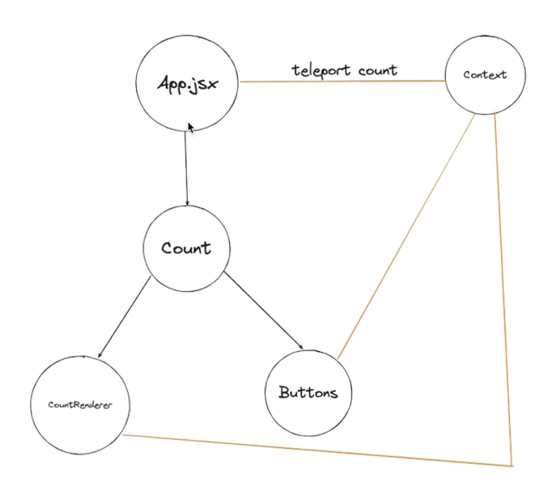
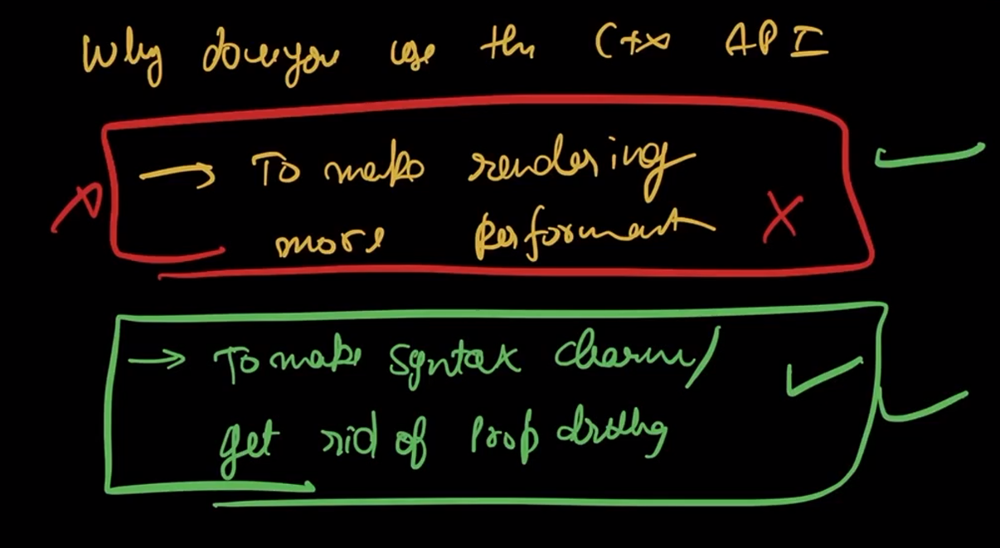

## Context API, State Management & Recoil

### Context API :

1. React gives you a built-in way to share state across multiple components without manually passing props through every level (no prop-drilling).



```
const CountContext = createContext();
// Create a context container to hold the shared values (name it in PascalCase)

<CountContext.Provider value={{ count, setCount }}>
  <App />
</CountContext.Provider>
// The Provider supplies the shared value to all components inside it

// === Using the context inside any child component:
const { count } = useContext(CountContext);
// Now the component can directly access the shared value

```

2. Any component that wants to access a context must be placed somewhere inside that context’s <Provider>.
   If it’s not wrapped (or its parent isn’t), useContext will return undefined.

3. Drawback of ContextAPI: If the context contains multiple values—say count and user—and only count updates, every component that consumes any part of that context will still re-render.This includes components that never use count at all.This unnecessary re-rendering is one of the major limitations of the Context API for large or frequently-updating global states.

### !Important


So it only fixes prop drilling and not re-rendering

## So what solves this problem: State Management Libraries like Recoil, Redux , Zustand etc.

4. State Management : A cleaner way to mange the state of your app and get rid of re-renders that contexAPI didn't solve

5. Always remeber to write your state and components separately.

## Recoil:


