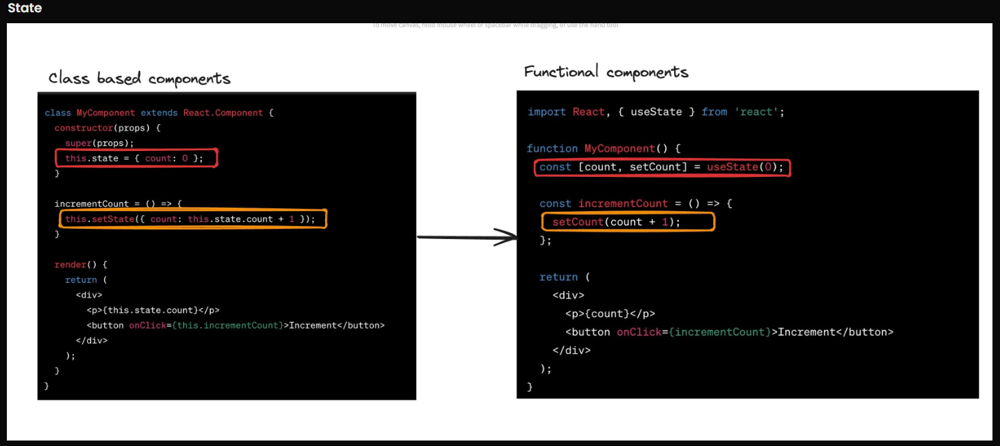
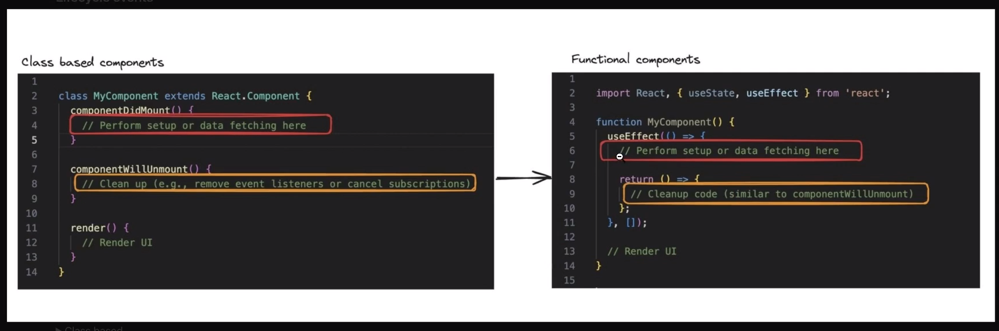
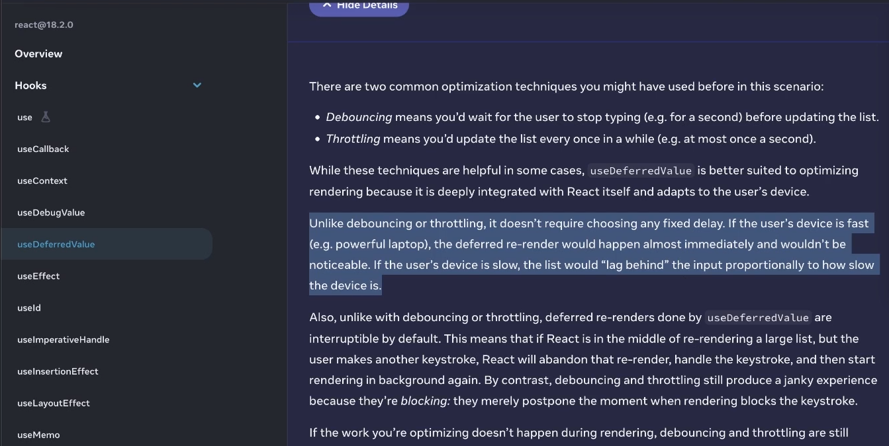

### Custom Hooks

1. What are Hooks?
   Hooks are features that were introuduced in React 16.8 which allowed functional component to use state and life cycle events to hook into components. Like using useState and useEffect. Earlier to functional components, there were class based components.So class based components didn't have any hooks.
   

2. Lifecycle events are : ComponentDidMount(), ComponentWillUnmount() etc that tracks the lifecycle or what is happening to the component. So these were provided by the above methods in class based componenets, but in functions compnents to track these lifecycle evnets we have hooks like useEffect, etc
   

3. So, custom hooks are that you create yourself that can be reused in the code. So, **custom hooks** are functions only but with the follownig properties:

- Uses another hook internally (useState, useEffect, any custom hook)
- Start with **use**

4. These can be used for :

- Data fetching hooks
- Browser functionality hooks - useOnlineStatus, useWindowSize, useMousePosition, etc.
- Performance/Timer Based = useInterval, useDebounce

5. Data Fetching Hooks:

- Writing one yourself

```
import { useEffect, useState } from 'react'
import axios from 'axios'

function useTodos() {
  const [todos, setTodos] = useState([])

  useEffect(() => {
    axios.get("https://sum-server.100xdevs.com/todos")
      .then(res => {
        setTodos(res.data.todos);
      })
  }, [])

  return todos;
}

function App() {
  const todos = useTodos();

  return (
    <>
      {todos.map(todo => <Track todo={todo} />)}
    </>
  )
}

function Track({ todo }) {
  return <div>
    {todo.title}
    <br />
    {todo.description}
  </div>
}

export default App
```

- You dont have to write this all yourself, libraries like useSwr, Tanstack Query provides us the same hooks like useSwr

```
import useSWR from 'swr'

// const fetcher = (url) => fetch(url).then((res) => res.json());
const fetcher = async function(url) {
  const data = await fetch(url);
  const json = await data.json();
  return json;
};

function Profile() {
  const { data, error, isLoading } = useSWR('https://sum-server.100xdevs.com/todos', fetcher)

  if (error) return <div>failed to load</div>
  if (isLoading) return <div>loading...</div>
  return <div>hello, you have {data.todos.length} todos!</div>
}
```

6. useDeferredValue instead of custom debounce/throttle
   
